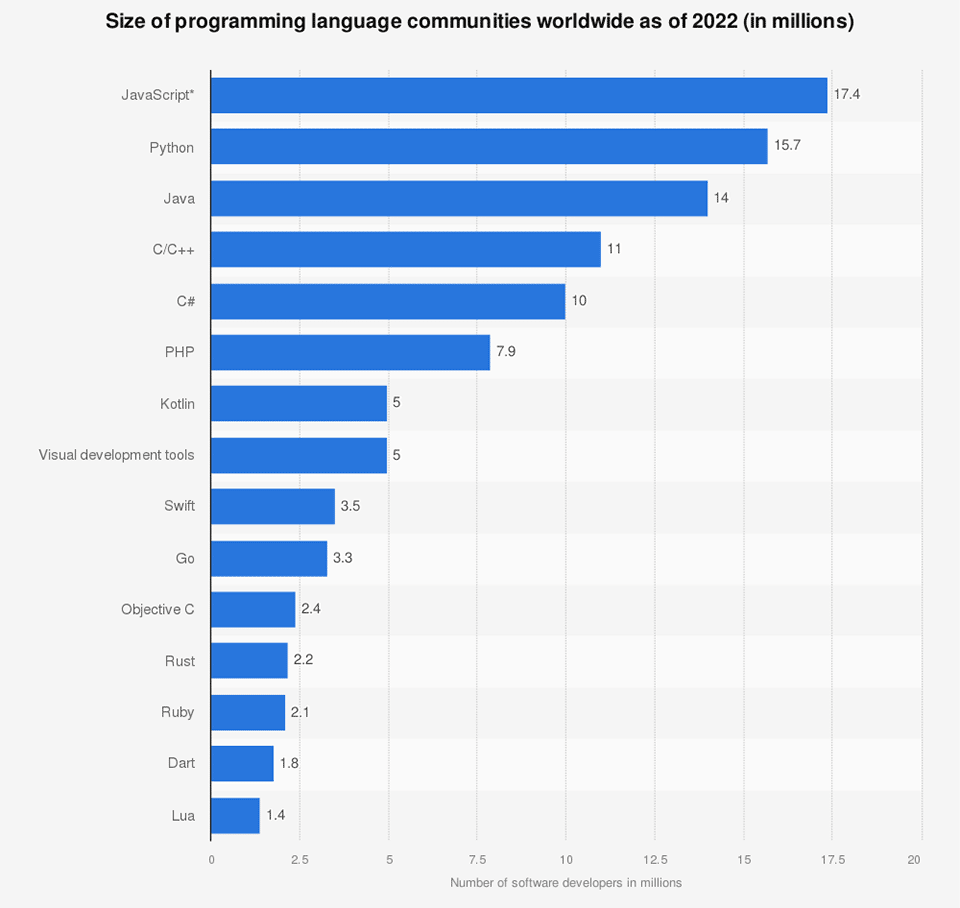

The 2022 SlashData survey found that there are over 17 million JavaScript developers worldwide, making it the leading language among popular ones like Python and Java. 

Slash/Data's 2022 survey on the programming languages used by developers. (Source: [Statista](https://www.statista.com/statistics/1241923/worldwide-software-developer-programming-language-communities/))

Part of the reason for its popularity can be attributed to the introduction of JavaScript frameworks like React, which simplified the development of applications. Additionally, developers can use package managers like npm (Node.js package manager) to install JavaScript libraries, extending JavaScript's capabilities and reducing the amount of code that needs to be written. This lowers the barrier to entry for novice web developers like me, allowing us to avoid the challenges of developing with vanilla JavaScript or AngularJS.

As time went on, new frameworks were developed on top of React to build upon its features, leading to the creation of many other hyped-up frameworks every year.

Among these, the framework that has gained the most popularity in recent years is Next.js, which aims to simplify the development of React applications with server-side rendering. Since Next.js is based on React, they share similar features. However, Next.js goes a step further by including additional functionalities such as routing, code splitting, and pre-rendering. These tools are built into Next.js, meaning developers don't have to configure anything manually. One of the most important features is pre-rendering, as it allows developers to improve the SEO of their web applications.

In the future, I intend to transition some of my personal React projects to Next.js to improve SEO and leverage its built-in functionalities. By learning features like server-side rendering and code splitting, I aim to create more advanced and compelling projects. This will not only expand my skill set as a developer but also deepen my understanding of the intricacies of web development.