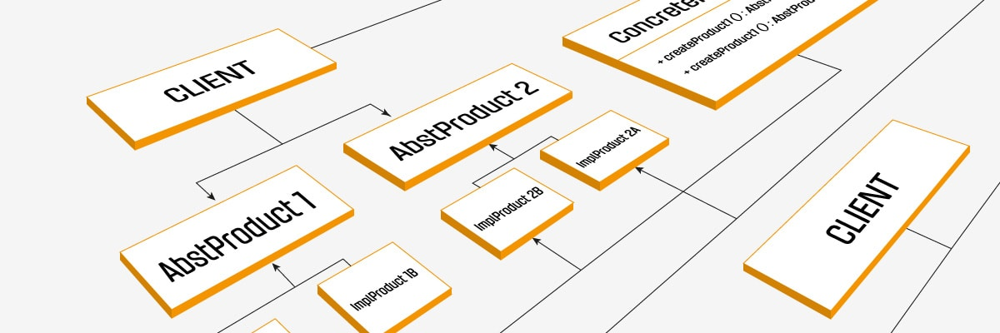

# How I Came to Appreciate Design Patterns
When I first started writing code, my approach was pretty naive. I’d open Visual Studio Code, write a bit of logic, and watch it run. If my program produced the right result, I’d consider it a win and move on. I wasn’t overly concerned with structure or long-term maintainability. I just wanted to solve the immediate problem, and it felt liberating. No complex guidelines, no heavy frameworks, just me, the code, and a quick sense of accomplishment. But as my projects grew, so did the complexity. Suddenly, making a small change in one corner of the codebase would create a domino effect of strange bugs somewhere else. I found myself wrestling with a tangle of functions and variables, and the carefree coding style I loved began to feel like a liability.

# My First Encounter: Model-View-Controller (MVC) Framework
Before taking the software development class at my university, I never even knew about the existence of design patterns but while working on the final projects for that class, I had the opportunity to familarize myself with one of the concept which is the Model-View-Controller framework. For that project, we seperated our NextJS applications into three distinct parts: the "Model" which manages data through Prisma in this projects, the "View" which handles the user interface rendering, and the "Controller" which acts as the intermediary, receiving user input and directing the Model to update data while also updating the View to reflect those changes.

Here’s an example code snippet from that final project:
```js
import { getServerSession } from 'next-auth';
import { Col, Container, Row } from 'react-bootstrap';
import { loggedInProtectedPage } from '@/lib/page-protection';
import authOptions from '@/lib/authOptions';
import { PrismaClient } from '@prisma/client';
import MySessionCard from '@/components/MySessionCard';

const prisma = new PrismaClient();

interface SessionType {
  id: number;
  location: string;
  time: string;
  musicalType: string;
  desiredCapabilities: string;
  organizerContact: string;
  owner: string;
}

const SessionsPage = async () => {
  const session = await getServerSession(authOptions);
  loggedInProtectedPage(
    session as {
      user: { email: string; id: string; randomKey: string };
    } | null,
  );

  // Fetch all sessions from the database
  const currentUser = session?.user?.email || '';
  const sessions: SessionType[] = (await prisma.session.findMany({
    select: {
      id: true,
      location: true,
      time: true,
      musicalType: true,
      desiredCapabilities: true,
      organizerContact: true,
      owner: true,
    },
  }))
    .filter((session) => session.owner === currentUser)
    .map((session) => ({
      ...session,
      time: session.time.toISOString(),
    }));

  return (
    <main>
      <Container id="sessions" fluid className="py-3">
        <Row>
          <Col className="text-center">
            <div className="p-2 rounded header-box mb-3">
              <h1 className="text-white">Your Jam Sessions</h1>
            </div>
          </Col>
        </Row>
        <Row xs={1} md={2} lg={3} className="g-4">
          {sessions.map((session) => (
            <Col key={`Session-${session.id}`}>
              <MySessionCard session={session} />
            </Col>
          ))}
        </Row>
      </Container>
    </main>
  );
};

export default SessionsPage;
```

This implementation captures the essence of MVC: the Model (“Prisma”) handles the data layer, the Controller (“this server-side logic”) processes user requests and interacts with the Model, and the View (“React components”) renders the user interface based on the processed data. It may sound straightforward, but applying this pattern was a game-changer. It brought clarity to what used to be a chaotic mess of logic intertwined with UI code.

# The "Aha" Moment

Using MVC for that project taught me more than just how to build applications. It showed me how a design pattern could bring structure to my work. Suddenly, the code I wrote wasn’t just functional, it was predictable and actually maintainable. Want to change how data is fetched? Update the Model. Need a new way for users to interact? Modify the Controller. Ready for a UI facelift? Revamp the View. Each piece had their own responsibility, and changes in one didn’t send ripples of chaos through the others.

The real "aha" moment came when I revisited one of my older, "free-spirited" projects. Compared to my MVC-based application, the old project was like a Jenga tower with pieces missing. Trying to fix a bug or add a feature felt like a game of "guess which function breaks next." The contrast was undeniable, and it made me realize just how much design patterns like MVC could elevate the scalability of a project.

# The Bigger Picture

When people ask, "What are design patterns?", I like to think of them as time-tested blueprints for solving recurring problems in software development. They’re not about reinventing the wheel but about using established practices to make your code cleaner and more reliable, which is something I think that both you and other developers will greatly appreciate.