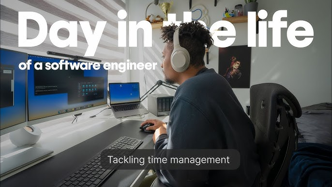

## How It All Began?

Born into a lower-middle-class Asian family, money has always been one of my biggest insecurities. This pushed me to live frugally and developed in me a deep obsession with financial security. One day, I came across a YouTube video titled "A Day in the Life of a Software Engineer..." and, naturally, the 12-year-old me was captivated by the six-figure salary, the generous stock-based compensation, and the seemingly excellent work-life balance. That video sparked my curiosity about coding, leading me to work on my first Python project. Over time, I discovered more ways software development could improve daily productivity, not just for making money, which only deepened my interest in the field.

## What To Do With Web Development
Although I have gained considerable knowledge in website development over the years through tutorials and small personal projects, I lack experience working on actual large-scale projects. Aside from a few small private projects that I developed and used at home, I haven't built any substantial projects to showcase my web development skills. In the future, I hope to deepen my understanding of backend development and find opportunities to work on larger, more sophisticated projects where I can put my skills into practice.

## IoT, Automating My Home
During the pandemic, I took on the task of automating my home out of sheer boredom. I connected everything, from power outlets to lights, to my Home Assistant, enabling a basic level of automation. While having a remote controller that can manage almost every electronic device in the house is convenient, I want to take the concept of automation even further. My goal is to create a system that automatically turns off unnecessary devices when everyone leaves the house or dims the lights when it detects someone falling asleep in bed. I aspire to combine machine learning and IoT to eliminate the need for manually switching devices on or off. Achieving this will require me to learn more about hardware and TinyML. I hope this experience will not only enhance my understanding of electronics and hardware but also expand my skill set in machine learning.