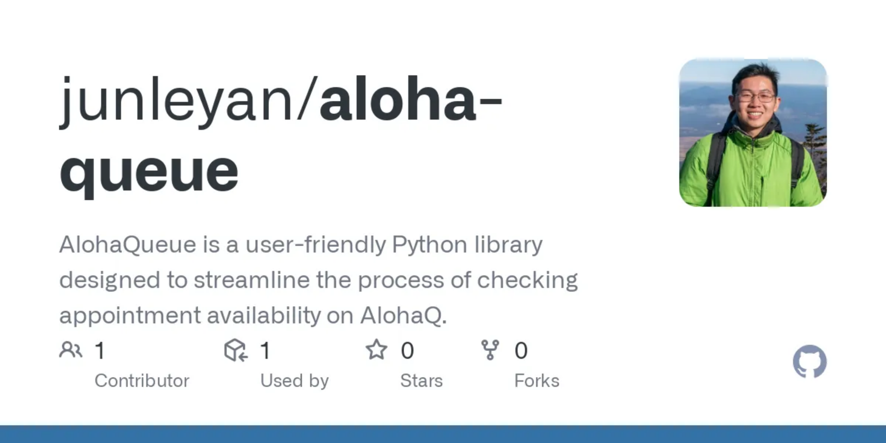

[AlohaQueue](https://github.com/junleyan/aloha-queue) is a user-friendly Python library designed to streamline the process of checking appointment availability on AlohaQ for people who do not want to wait another whole month for their appointment and deal with the terrible UX of the AlohaQ web applications. 

This project was initiated shortly after the pandemic shutdown, during a time when everyone rushed to the satellite city hall to renew their driver’s licenses and state IDs before they expired, as city halls were closed during the shutdown. Due to the high demand for appointments, the earliest available date for an appointment could be three months away. Frustrated by these issues, I decided to build a tool to automatically check the website for new availability, so I wouldn’t have to manually check the website myself and deal with the poor user experience of the AlohaQ website.

For me, this project served as an exciting gateway to explore several essential topics in web development, including web scraping, REST APIs, and methods for analyzing network traffic within web applications. I delved deeply into the intricacies of web scraping, learning how to extract and manipulate data from various online sources effectively. Additionally, I gained valuable insights into REST API.

One of the highlights of this project was that it marked my first experience creating a Python library. Throughout this process, I learned a great deal about the steps involved in developing and maintaining a library, from initial design and coding to testing and documentation. I also navigated the process of publishing my library on the Python Package Index (PyPI), which introduced me to the broader Python community and the best practices for versioning and updating libraries. Overall, this project significantly enhanced my technical skills and expanded my understanding of web development, providing me with a solid foundation for future projects.

If you are interested in using my library, the guide is below for installation and usage.

## Installation
``` sh
pip install aloha-queue
```   

## Examples
Here is a code snippet utilizing the library to check for appointment availability at Kapalama Driver Licensing Center
```py
from alohaqueue import QueueChecker

# QueueChecker(location, target month, target day, target year)
checker = QueueChecker("KAPA", 12, 12, 2023)

# returns all available appointment dates before 12/12/2023
available_dates = checker.get_available_dates
# returns all available appointment time on 06/06/2023
available_time = checker.get_available_time("2023-06-06")
```