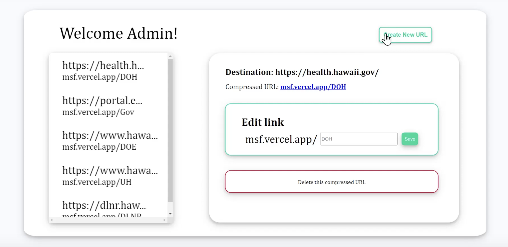

MagSafe is a web address-shortening platform that helps state agencies share web content in a more organized and secure manner.

## Inspiration
We recognized the risks involved in using public web address-shortening services such as Bitly and TinyURL. Although these services are free and convenient to use, they are often a precursor to data breaches and ransomware attacks. To combat this issue, we designed our web address shortening platform intending to offer better security and to protect the State of Hawaii’s branding.
What it does

## What it does
Our application has 3 primary functions that are key elements of a web address-shortening service. Access to these functions is protected through the authentication of a username and password.

- Users can create shortened web addresses with their chosen aliases that redirect them to their inputted destination web address.
- Users can modify their shortened web addresses with a newly inputted alias.
- Users can delete their existing shortened web addresses.

## Accomplishments that we're proud of
Though we only had intermediate knowledge of react hooks, we were successful in creating a fully dynamic website that changes with user inputs and adapts to the viewport. We also had major successes with developing the backend as we were able to establish an efficient and modular code structure that made development easy. Overall, we saw this project as a major milestone and accomplishment in regard to our web development skills as we were able to gain experience working with a large-scale project and experience the whole development cycle.