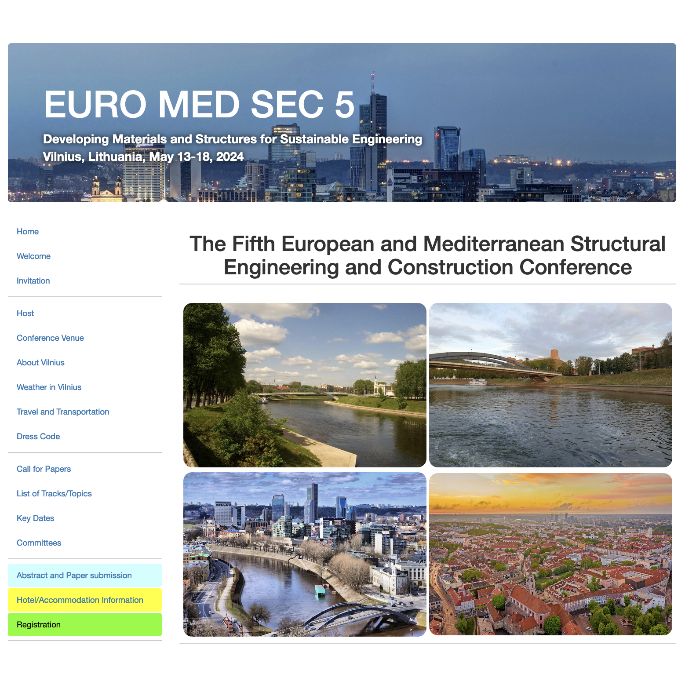

Recently, I joined the International Structural Engineering and Construction Society (ISEC) as a full-stack developer. In this role, I am not only engaged in software development but also actively participate in the day-to-day operations of the organization. My responsibilities range from responding to client emails to managing payment processes, ensuring smooth communication and efficient workflow.

On the software development side of my role, I am responsible for setting up new conference websites for each upcoming conference. These websites are crucial for managing paper submissions and providing information about the conferences. 

This is conference website for [EURO-MED-SEC-5](https://www.isec-society.org/EURO_MED_SEC_05/) held in Vilnius, Lithuania, on 13–18 May 2024. The website showcase information regarding on the conference and enables for paper submission for conference review. This conference provides an opportunity for scientists, engineers, managers, and professionals from around the world to share the latest achievements in the civil engineering field.

Throughout my experience in setting up these websites, I gained valuable insights into the organizational structure of ISEC and learned more about how organizations like ours manage paper submissions and publications. This position also provided me with my first hands-on experience working directly with PHP and SQL. Transitioning from my background in JavaScript to PHP was undoubtedly a unique challenge. I embraced this opportunity to broaden my skill set and explore a programming language that differs significantly from what I am accustomed to.

Overall, this role has not only enhanced my technical skills but also deepened my understanding of the operational aspects of a professional organization, making it a truly enriching experience.